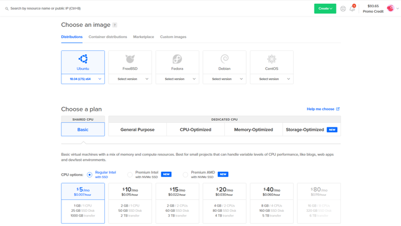
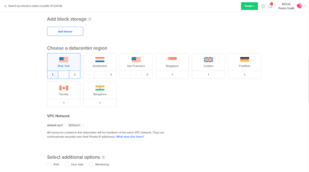
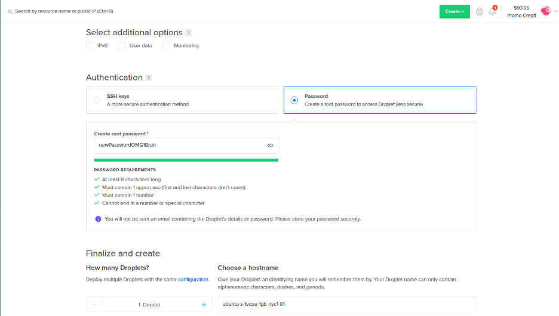
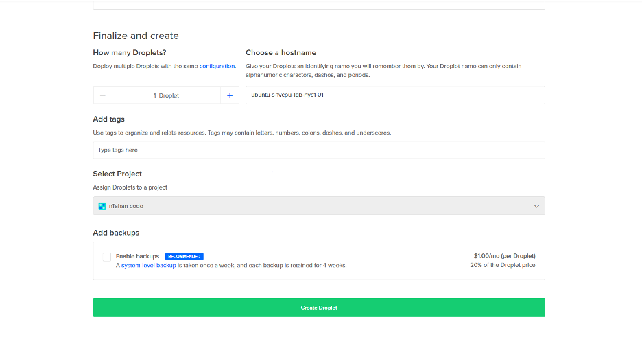
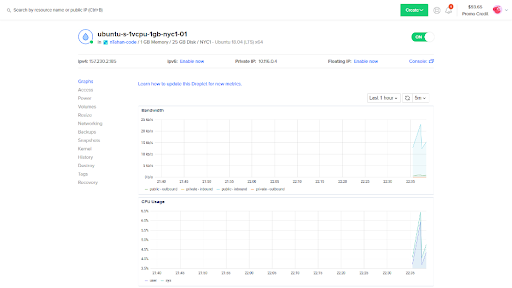
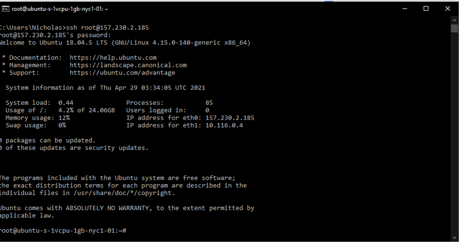


Group 9

Nicholas Tahan

Christopher Scully

Jackson Phillips

Natalie Myers

Software Engineering

University of Missouri - Columbia

Professor Goggins

Spring 2021

May 14, 2021

# Installing Augur on an Ubuntu 18.04 X86_64 DigitalOcean Droplet by Group 9

 

 -  Sign into a DigitalOcean account and select create Droplet. (Select the settings below). Depending on your needs you may want to select a more powerful plan.

 - Once you’ve selected a pricing option, you can choose a region for your droplet, we recommend a region that is close to your area in consideration of network latency.

 - Select a method to connect to your droplet. For ease of use, creating a password would be optimal. For security purposes an SSH key would be a more viable long term solution.

 - Finalize your droplet creation. In “Choose a Hostname” You can rename your droplet if you want.

 - Select your created droplet. Below there is information about the state of the droplet and its performance. In order to connect to your droplet, copy the ipv4 address and type in terminal: <code>ssh root@ipv4_address</code>

## Do the Following:

 - Install gcc
	 - <code>sudo apt update </code>
	 - <code>sudo apt build-essential </code>
	 - <code>gcc --version</code>
 - Create a GitHub Access Token
 - Create a GitLab Access Token
 - Install Python (3.6, 3.7 or 3.9)
	 - <code>sudo apt-get update</code>
	 - <code>sudo apt-get install -y python3.8</code>
 - Install Node and NPM
	 - <code>sudo apt update</code>
	 - <code>sudo apt install nodejs</code>
	 - <code>sudo apt install npm</code>
	 - <code>nodejs -v</code>
 - Installing Augur
	 - <code>git clone https://github.com/chaoss/augur.git</code>
	 - <code>cd augur</code>
 - Create and start the Python virtual environment (Double check you have Python 3.6, 3.7 or 3.8 installed)
	 - <code>python3 -m venv $HOME/.virtualenvs/augur_env</code>
	 - <code>source $HOME/.virtualenvs/augur_env/bin/activate</code>
 - Installing Augur Cont.
	 - <code>make install</code>
	 - <code>make install-dev</code>
		 - Use if you want to develop with Augur.
 - Common Issues:
	 - TensorFlow Fails to install
		 - Make sure you do not have Python 3.9 installed.
		 - <code>pip install tensorflow==2.2.1 --no-cache-dir</code>
	 - Database can not connect to Augur
		 - Make sure your database is formatted to connect to Augur.
	 - Other Python Packages Fail to install
		 - Install Python modules using pip before running <code>make install</code> 

